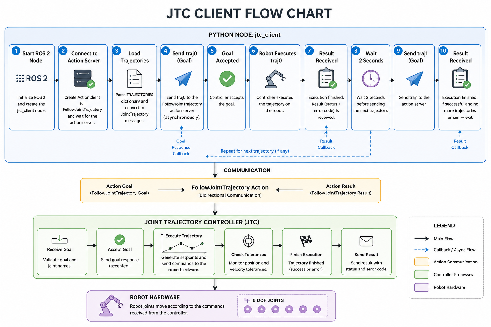

### Gazebo UR3 MoveIt
---------------------------------

* ROS2 Jazzy
* Gazebo Harmonic
* WSL

1. Install require

```
sudo apt install -y ros-jazzy-ros-gz \
    ros-jazzy-gz-ros2-control \
    ros-jazzy-ros2-control \
    ros-jazzy-ros2-controllers \
    ros-jazzy-joint-state-publisher-gui \
    ros-jazzy-xacro \
    ros-jazzy-robot-state-publisher \
    ros-jazzy-rviz2 \
    ros-jazzy-moveit \
    ros-jazzy-ur-robot-driver \
    ros-jazzy-ur-moveit-config


```

2. Cloned the Universal Robots Universal_Robots_ROS2_Description repository

```
git clone -b jazzy https://github.com/UniversalRobots/Universal_Robots_ROS2_Description.git
```

3. Build and test

```
colcon build --symlink-install
ros2 launch ur_description view_ur.launch.xml ur_type:=ur3
```

4. Simulate gazebo and rviz at the same time

```
git clone -b jazzy https://github.com/UniversalRobots/Universal_Robots_ROS2_GZ_Simulation.git
ros2 launch ur_simulation_gz ur_sim_control.launch.py ur_type:=ur3
```

5. Test movement

```
ros2 topic pub --once \
/scaled_joint_trajectory_controller/joint_trajectory \
trajectory_msgs/msg/JointTrajectory \
"{
  joint_names: [
    'shoulder_pan_joint',
    'shoulder_lift_joint',
    'elbow_joint',
    'wrist_1_joint',
    'wrist_2_joint',
    'wrist_3_joint'
  ],
  points: [
    {
      positions: [0.2, -1.0, 1.0, -1.5, -1.0, 0.2],
      time_from_start: {sec: 3}
    }
  ]
}"
```

### Simple MoveIt example
---------------------------------


1. Create moveit test package, with run a python script for test

```
ros2 pkg create ur3_moveit_example --build-type ament_python  --dependencies rclpy geometry_msgs moveit_py
```

2. Create test script under `ur3_moveit_example`, here copy the simple_move.py from ros_robot_driver

```
code ur3_move.py
```

3. Creates a command-line executable for Python node, edit `setup.py`

'ur3_move = ur3_moveit_example.ur3_move:main'
   │                  │                  │
   │                  │                  └── function to call
   │                  └── Python module
   └── command you type in terminal
```
code setup.py
```

4. Add the ur3_move in `console_scripts` under `entry_points`

```
'ur3_move = ur3_moveit_example.ur3_move:main'
```

5. Build project

```
colcon build --symlink-install
```

6. Run test

- One terminal to launch gazebo env

```
ros2 launch ur_simulation_gz ur_sim_moveit.launch.py
```

- Other run the move test

```
ros2 run ur3_moveit_example ur3_move
```

### Add Gripper
---------------------------------

1. run gripper sample

```
ros2 launch gz_ros2_control_demos gripper_mimic_joint_example_position.launch.py
```

2. Publish message to control gripper finger position

- Open position

```
ros2 topic pub --once   /gripper_controller/commands   std_msgs/msg/Float64MultiArray   "{data: [0.0]}"
```

- Close position

```
ros2 topic pub --once   /gripper_controller/commands   std_msgs/msg/Float64MultiArray   "{data: [0.4]}"
```

## Moveit Gripper

               MoveIt
                  │
                  │
             gripper group
                  │
                  ▼
        right_finger_joint
                  │
                  │ mimic
                  ▼
        left_finger_joint

1. modify the gripper collision

copy `gripper_mimic_joint_example_position.xacro.urdf` to `urdf`, and add collision inside `<link name="finger_right">` and `<link name="finger_left">`

```
<collision>
  <geometry>
    <box size="0.4 0.1 1"/>
  </geometry>
</collision>
```

2. create a launch file in own package for open own xacro.urdf, reference `gripper_display.launch.py`

3. modify `setup.py` to make sure installs the URDF and launch file in `data_files`

```
(
    os.path.join('share', 'ur3_moveit_example', 'urdf'),
    glob('urdf/*')
),
(
    os.path.join('share', 'ur3_moveit_example', 'launch'),
    glob('launch/*.launch.py')
),
```
