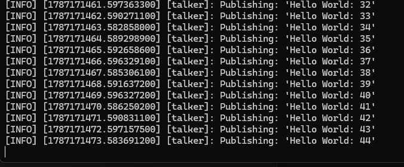
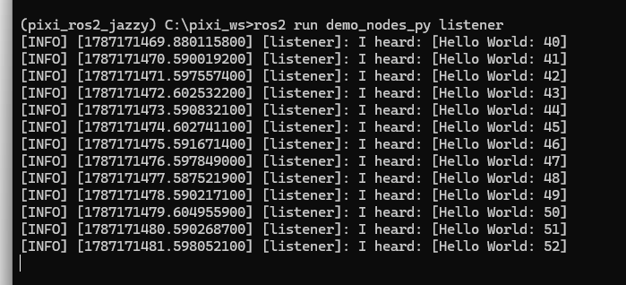
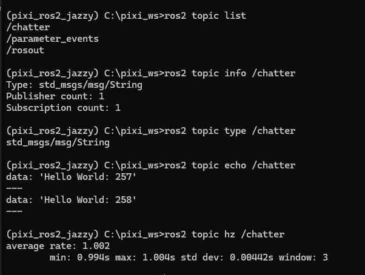
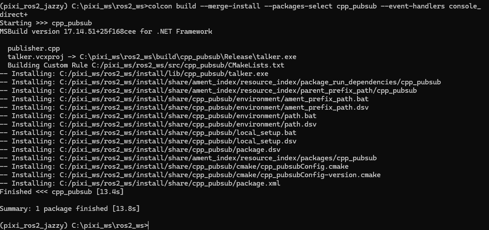
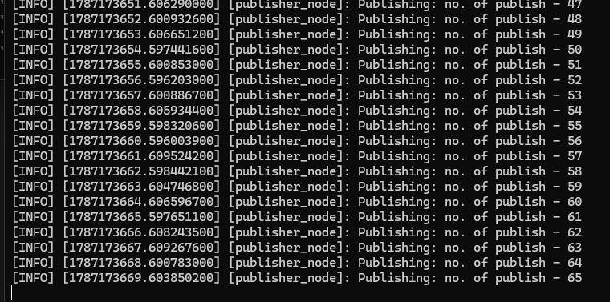
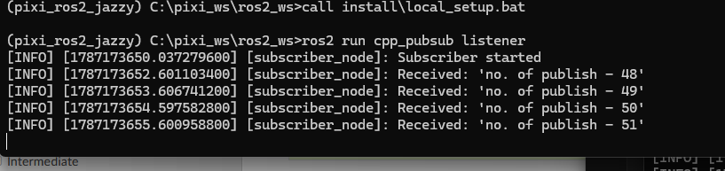
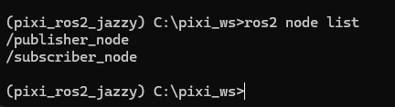

### publisher and subscriber example
---------------------------------
@ reference
https://docs.ros.org/en/jazzy/Installation/Windows-Install-Binary.html#system-requirements


Publisher Node
      │
      │  publish message
      ▼
   /chatter (topic)
      │
      │  receive message
      ▼
Subscriber Node


## Run publisher and subscriber 

1. In a command prompt, set up the ROS 2 environment as described above and then run a C++ talker:

```
ros2 run demo_nodes_cpp talker
```



2. Start another command shell and run a Python listener:

```
ros2 run demo_nodes_py listener
```



## Topic
Show all topices

```
ros2 topic list
```

Show topic information, including message type, publishers, and subscribers.

```
ros2 topic info /chatter
```

Show the message type used by the topic.

```
ros2 topic type /chatter
```

Show the actual messages being published.

```
ros2 topic echo /chatter
```

Show the publishing frequency (Hz).

```
ros2 topic hz /chatter
```




## Create Publisher node CPP

1. Negative to the project direction

```
cd ros2_ws/src
```

2. Create ROS2 package include license `Apache-2.0` and dependencies `rclcpp` and `std_msgs`

```
ros2 pkg create pubsub_cpp --build-type ament_cmake --license Apache-2.0 --dependencies rclcpp std_msgs
```

3. Add `publisher.cpp` and `subscriber.cpp` under `pubsub_cpp\src`

4. Make sure dependencies inside `package.xml`
<depend>rclcpp</depend>
<depend>std_msgs</depend>

5. Modify `CMakeLists.txt` should inclde: 

```
find_package(ament_cmake REQUIRED)
find_package(rclcpp REQUIRED)
find_package(std_msgs REQUIRED)

add_executable(talker src/publisher.cpp)
add_executable(listener src/subscriber.cpp)
ament_target_dependencies(talker rclcpp std_msgs)
ament_target_dependencies(listener rclcpp std_msgs)

install(TARGETS
  talker
  listener
  DESTINATION lib/${PROJECT_NAME})
```

6. Before build it may missing Visual Studi Version

```
call "C:\Program Files\Microsoft Visual Studio\2022\Community\Common7\Tools\VsDevCmd.bat"
echo %VisualStudioVersion%
```

7. Build project

```
colcon build --merge-install --packages-select pubsub_cpp --event-handlers console_direct+
```



8. Source setup file
```
call install\local_setup.bat
```

9. One termial run publisher 

```
ros2 run cpp_pubsub talker
```



10. Other terminal run subscriber

```
ros2 run cpp_pubsub listener
```



11. Other terminal check number of nodes in ROS2

```
ros2 node list
```

